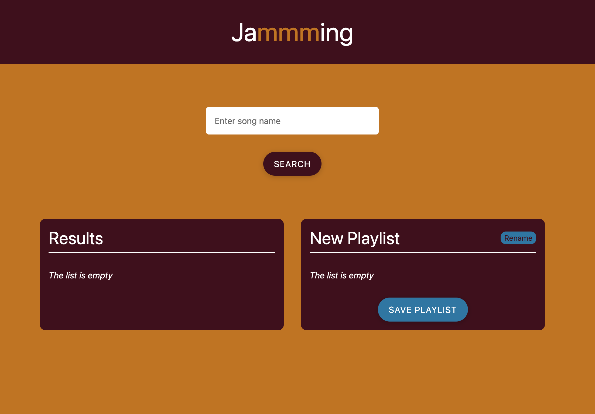

# Jammming - Codecademy Practice Project



### Description

This is a solution to the Codecademy Practice Project Jammming as part of the [Full-Stack Engineer Career Path](https://www.codecademy.com/career-journey/full-stack-engineer).

### Features

- **Search**: Search the Spotify library for tracks.
- **Previews**: Listen to previews of the tracks.
- **Create custom playlists and save** to your Spotify account by adding tracks from search results.

### Technologies

- **React:** JavaScript library for building user interfaces.
- **Spotify API:** Used for searching tracks and managing playlists. PKCE oAuth2 flow to authenticate.

* against the Spotify Accounts.

- **CSS.**
- **Semantic HTML.**

### Installation and Setup Instructions

Clone this repository. You will need `node` and `npm` installed globally on your machine.

```bash
git clone https://github.com/norrland90/jammming-codecademy-practice-project
```

Install dependencies and run the application

```bash
npm install
npm start
```

Make sure to create a developer account on Spotify as well as creating an app to get your credentials. Add credentials to the Spotify.js file.

### Links

- GitHub URL: [https://github.com/norrland90/jammming-codecademy-practice-project]

### Contact

Created by [@norrland90](https://github.com/norrland90) - feel free to contact me!
